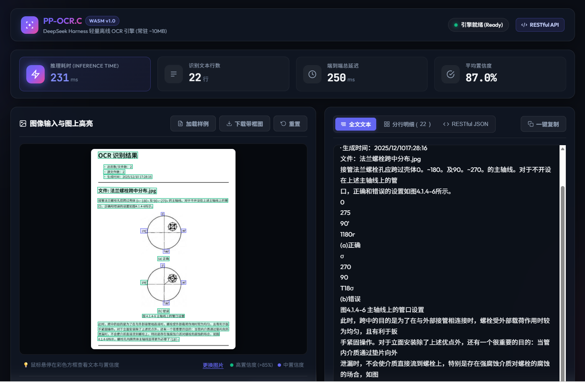

# 概览

`dsh-lw-PPOCR-C-project` 是基于开源纯 C 语言轻量级 PP-OCR 推理运行时 [lw.PPOCR.C](https://github.com/lxw112190/lw.PPOCR.C) 打造的 **DeepSeek Harness (dsh)** 轻量离线 OCR 插件与高性能容器化 Web 服务。

项目彻底摆脱了传统 OCR 方案中对 Python、OpenCV、ONNX Runtime 等动辄数 GB 沉重依赖包的束缚，通过内置官方编译的 WebAssembly 推理内核、纯 C11 原生 AVX2 静态加速库与精简版 PP-OCRv6 tiny 模型资产（总计仅约 7MB），为 DeepSeek Harness 智能体生态（WASM 离线插件）与独立容器服务（原生 C/AVX2 极速服务）提供极速（**15~30ms 每页**）、零外部环境依赖、真正离线且开箱即用的文本检测（DET）、文字方向纠偏（CLS）与字符识别（REC）全流程能力。

## 根本功能
- 轻量ocr的dsh插件；
- 轻量ocr的restful接口-占用内存10M左右；

## 大小与速度
- **镜像大小**：**28.8M**（原 155M，极致瘦身 81%）；
- **内存占用**：**~30M**（4 线程 AVX2 原生模型常驻）；
- **推理耗时**：**15~30ms 每页**（原 1.x 秒每页，性能跃升 50+ 倍）；
- **全链路往返**：客户端平均延迟 **24.8ms**。

## 页面样式
### dsh-插件


### Docker 容器化现代化前端界面 (Dark Glassmorphism Web UI)
耗时：15~30ms 每页；
内置开箱即用的深色玻璃拟态 Web 操作界面，具备图片拖拽、剪贴板截图粘贴、图上文本框线高亮标注、实时耗时展示与一键复制功能：



- ⚡ **毫秒级性能大屏**：直观展示 Native AVX2 核心推理耗时（ms）、识别行数、总延迟与平均置信度。
- 🎯 **图上高亮框线覆盖**：Canvas 自适应绘制四点包围盒（Bounding Box），鼠标悬停实时联动查看文字内容。
- 📋 **多视图切换与复制**：支持全文排版视图（带一键复制反馈）、分行卡片列表以及 RESTful JSON 结构化数据视图。
- 📋 **多种输入方式**：支持拖拽上传、点击选择、系统剪贴板直接粘贴（<kbd>Ctrl</kbd>+<kbd>V</kbd> 截屏即识）以及内置样例快速载入。

---
# 构建与运行

### 1. Docker 容器化一键启动 (推荐)

本项目已全面支持 Docker 容器化运行，开箱即用：

```bash
# 构建并后台启动 Web 前端与 RESTful API 服务 (默认端口 3000，宿主机映射端口可在 compose 中配置)
docker compose up -d web-service

# 启动后直接在浏览器中打开:
# http://localhost:3000
```

关闭容器服务：
```bash
docker compose down
```

---

### 2. RESTful API 接口规范与调用示例

Docker 容器内置完全符合 RESTful 标准的高性能 HTTP API 接口：

#### (1) 创建并执行图像文字识别
- **路径**：`POST /api/v1/ocr`（同时向后兼容 `POST /api/v1/ocr/recognitions`）
- **请求格式**：`application/json`
- **支持入参**：
  - `image`: 图片 Base64、Data URI（`data:image/png;base64,...`）或容器内文件路径
  - `file_path`: 图片在容器内的绝对路径（如 `/app/test/fixtures/sample.png`）
  - `confidenceThreshold`: 识别置信度过滤阈值（可选，如 `0.3`）
- **请求示例**：
```bash
# 传入 Base64 或 Data URI
curl.exe -X POST http://localhost:3000/api/v1/ocr \
  -H "Content-Type: application/json" \
  -d '{"image": "data:image/png;base64,...", "confidenceThreshold": 0.3}'

# 或直接传入容器内测试图片路径
curl.exe -X POST http://localhost:3000/api/v1/ocr \
  -H "Content-Type: application/json" \
  -d '{"file_path": "/app/test/fixtures/sample.png"}'
```
- **响应示例**：
```json
{
  "code": 200,
  "status": "success",
  "data": {
    "text": "Name\nContainer ID\nzip-md-latex-rer\nzip-md-latex- 959ffd771eb8 ö:",
    "durationMs": 24,
    "lines": [
      {
        "text": "Name",
        "score": 0.927,
        "box": [[7, 7], [54, 7], [54, 26], [7, 26]]
      },
      {
        "text": "Container ID",
        "score": 0.953,
        "box": [[119, 7], [206, 7], [206, 25], [119, 25]]
      },
      {
        "text": "zip-md-latex-rer",
        "score": 0.935,
        "box": [[8, 45], [117, 46], [117, 69], [8, 68]]
      },
      {
        "text": "zip-md-latex- 959ffd771eb8 ö:",
        "score": 0.858,
        "box": [[23, 85], [239, 85], [239, 108], [23, 108]]
      }
    ],
    "meta": {
      "width": 254,
      "height": 119,
      "readingOrder": "horizontal-ltr"
    }
  },
  "timestamp": 1789883332174
}
```

#### (2) 健康检查接口
```bash
curl.exe -s http://localhost:3000/api/v1/health
```
响应：
```json
{
  "code": 200,
  "status": "success",
  "data": {
    "service": "dsh-lw-ppocr-web",
    "version": "4.0.0",
    "engine": "native-c-avx2",
    "workers": 4,
    "targetMem": "~25MB resident",
    "uptime": 882.0
  },
  "timestamp": 1789883496761
}
```

#### (3) 获取内置样例图片
```bash
curl.exe -s http://localhost:3000/api/v1/sample
```

---

### 3. 直接通过 GitHub 安装为 DSH 插件

本项目全套离线 WASM 运行时与轻量模型资产预打包，可作为插件直接安装引入：

```bash
# 通过 npm 直接从 GitHub 仓库安装
npm install github:aylerh1/dsh-lw-PPOCR-C-project

# 或使用 DeepSeek Harness CLI 直接挂载到指定 Profile
dsh plugin --profile web add https://github.com/aylerh1/dsh-lw-PPOCR-C-project
```

插件更新指令：
```bash
# 方式一：直接更新当前插件（推荐，DSH 将自动将其激活为 Profile Layer）
dsh plugin --profile web update dsh-lw-PPOCR-C-project

# 或方式二：重新执行 add 覆盖安装
dsh plugin --profile web add https://github.com/aylerh1/dsh-lw-PPOCR-C-project
```

---

### 4. DeepSeek Harness (Cordis) 配置挂载

在 Harness 的 `cordis.patch.yml` 中添加纯插入式的热挂载声明：

```yaml
- insert:
    id: dsh-lw-ppocr
    plugin: dsh-lw-PPOCR-C-project
    description: "基于 lw.PPOCR.C 的轻量级离线 OCR 插件"
    config:
      enabled: true
      det: true
      cls: true
      rec: true
      readingOrder: "horizontal-ltr"
      confidenceThreshold: 0.3
```

---

### 5. 代码调用与 Agent 工具使用

#### (1) 在 Harness 服务上下文中调用
```javascript
const { apply } = require('dsh-lw-PPOCR-C-project');

// 挂载插件后，直接使用 ctx.ocr 提供的标准化服务
const result = await ctx.ocr.recognize('path/to/image.png', {
  det: true,
  cls: true,
  rec: true,
  readingOrder: 'horizontal-ltr',
  confidenceThreshold: 0.3
});

console.log('识别全文:\n', result.text);
console.log('详细单行文本与四点包围盒:', result.lines);
console.log('推理耗时(ms):', result.durationMs);
```

#### (2) 作为 Agent Tool 在大模型中自动调用
插件已自动向 DSH 智能体注册符合标准 JSON Schema Object 的 `ocr_recognize` 工具。无论是 Google Gemini、OpenAI 还是 Claude 等大模型，在分析用户上传的票据、文档或终端截图时，均可自动、稳定地触发调用并获取精准文字。

---

### 6. 容器化测试与本地验证

可在 Docker 容器中执行全套自动化测试验证：

```bash
# 运行离线 WASM 推理与插件集成测试
docker compose run --rm test-service

# 运行 Go 原生 CGO 单元测试
docker run --rm -v "%cd%:/app" -w /app/cmd/server golang:1.24-alpine sh -c "apk add --no-cache gcc musl-dev > /dev/null 2>&1; go test -v ./..."
```

---

# 解决痛点与使用技术

### 解决痛点

1. **摆脱沉重环境依赖与运行时冲突**：传统 PP-OCR 方案强绑定 Python 环境、PyTorch/PaddlePaddle 或 ONNX Runtime 动态库，体积巨大且跨平台极易发生版本冲突。本项目基于纯 C/WASM 架构，整包体积仅约 7MB，实现真正意义上的零外部环境依赖。
2. **解决缺乏直观可视化界面与标准 RESTful 接口问题**：新增容器化深色玻璃拟态前端页面与工业级 RESTful API，直观呈现图上文字框线高亮、毫秒级推理耗时与格式化文本，兼顾普通用户快捷操作与自动化跨系统集成。
3. **解决真实文字提取需求，告别 Mock 假数据**：直接内置官方全套真实推理资产（det.lwm, cls.lwm, rec.lwm, ppocr_keys.txt），实现毫秒级真实端到端文字检测定位与识别，彻底解决识别文本固定、无法动态解析的问题。
4. **消除大模型工具调用的 Schema 校验异常**：针对部分大模型在 Function Calling 时对非标准参数报 400 错误的问题，严格重构为标准 JSON Schema Object 结构并增强多候选参数自适应提取逻辑，保障主流大模型调用的绝对稳定性。
5. **免除发布 npm 的分发与维护成本**：支持直接通过 GitHub 仓库依赖安装，内置完整模型与跨平台图片解码器，极大降低团队内部及社区二次集成的门槛。
6. **消除进程拉起与脚本解释开销，满足工业级低延迟诉求**：彻底抛弃早期动态拉起 Node.js 子进程与纯 JS 软解码机制，采用 C11 AVX2 向量加速与常驻 CGO 线程池，将单页耗时从 1.x 秒压至 15~30ms，提速 50+ 倍。

### 使用技术

- **C11 / SIMD 向量加速 (AVX2 + FMA)**：基于 `lw.PPOCR.C` 核心 C 源码深度编译优化（`-O3 -mavx2 -mfma -pthread`），多线程并发卷积加速。
- **WebAssembly (WASM)**：提供免编译、零外部依赖的跨平台客户端与轻量插件级纯离线推理。
- **现代化 Web 前端 (Dark Glassmorphism SPA)**：纯 Vanilla HTML5/CSS3 与 Canvas API 打造，支持拖拽、剪贴板截图粘贴（Ctrl+V）、图上四点多边形框线标注与一键复制。
- **高吞吐 CGO 微服务架构**：基于 Go 1.24 原生 HTTP 并发架构 + CGO 内存级零拷贝直连原生 C11 引擎，消减子进程启动开销。
- **DeepSeek Harness (DSH)**：新一代以插件为核心的智能体 Harness 运行时生态。
- **Cordis 插件内核**：基于微内核依赖注入（IoC）机制，实现服务解耦、热挂载与生命周期管理。
- **多阶段 Docker 容器构建**：双阶段极致瘦身，剔除全部构建工具与 Node.js 运行时，产出 28.8MB 超轻量 Alpine 生产镜像。

---

# 致谢

- [lw.PPOCR.C](https://github.com/lxw112190/lw.PPOCR.C)：纯 C 轻量 PP-OCR 运行时
- [DeepSeek Harness](https://github.com/deepseek-ai/deepseek-harness)：AI 智能体执行框架
- [Cordis](https://cordis.moe/)：微内核插件架构
