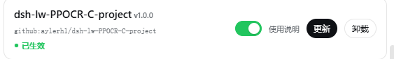

# 概览

`dsh-lw-PPOCR-C-project` 是基于开源纯 C 语言轻量级 PP-OCR 推理运行时 [lw.PPOCR.C](https://github.com/lxw112190/lw.PPOCR.C) 打造的 **DeepSeek Harness (dsh)** 轻量离线 OCR 插件。

项目彻底摆脱了传统 OCR 方案中对 Python、OpenCV、ONNX Runtime 等动辄数 GB 沉重依赖包的束缚，通过内置官方预编译的 WebAssembly 推理内核与精简版 PP-OCRv6 tiny 模型资产（总计仅约 7MB），为 DeepSeek Harness 智能体生态提供极速（100~150ms）、零外部环境依赖、真正离线且开箱即用的文本检测（DET）、文字方向纠偏（CLS）与字符识别（REC）全流程能力。

## 页面样式

### 主页



# 构建与运行

### 1. 直接通过 GitHub 安装（无需发布到 npm）

本项目已将全套离线 WASM 运行时与轻量模型资产预打包，用户无需安装本地 C/C++ 编译环境即可直接安装引入：

```bash
# 通过 npm 直接从 GitHub 仓库安装
npm install github:aylerh1/dsh-lw-PPOCR-C-project

# 或使用 DeepSeek Harness CLI 直接挂载到指定 Profile
dsh plugin --profile web add https://github.com/aylerh1/dsh-lw-PPOCR-C-project
```

插件更新指令：
```bash
# 方式一：直接更新当前插件（推荐，DSH 将自动将其激活为 Profile Layer）
dsh plugin --profile web update dsh-lw-PPOCR-C-project

# 或方式二：重新执行 add 覆盖安装
dsh plugin --profile web add https://github.com/aylerh1/dsh-lw-PPOCR-C-project
```

### 2. DeepSeek Harness (Cordis) 配置挂载

在 Harness 的 `cordis.patch.yml` 中添加纯插入式的热挂载声明：

```yaml
- insert:
    id: dsh-lw-ppocr
    plugin: dsh-lw-PPOCR-C-project
    description: "基于 lw.PPOCR.C 的轻量级离线 OCR 插件"
    config:
      enabled: true
      det: true
      cls: true
      rec: true
      readingOrder: "horizontal-ltr"
      confidenceThreshold: 0.3
```

### 3. 代码调用与 Agent 工具使用

#### (1) 在 Harness 服务上下文中调用
```javascript
const { apply } = require('dsh-lw-PPOCR-C-project');

// 挂载插件后，直接使用 ctx.ocr 提供的标准化服务
const result = await ctx.ocr.recognize('path/to/image.png', {
  det: true,
  cls: true,
  rec: true,
  readingOrder: 'horizontal-ltr',
  confidenceThreshold: 0.3
});

console.log('识别全文:\n', result.text);
console.log('详细单行文本与四点包围盒:', result.lines);
console.log('推理耗时(ms):', result.durationMs);
```

#### (2) 作为 Agent Tool 在大模型中自动调用
插件已自动向 DSH 智能体注册符合标准 JSON Schema Object 的 `ocr_recognize` 工具。无论是 Google Gemini、OpenAI 还是 Claude 等大模型，在分析用户上传的票据、文档或终端截图时，均可自动、稳定地触发调用并获取精准文字。

### 4. 本地运行与测试验证

本项目零外部沉重依赖，开箱即用，可在本地直接执行全套自动化测试验证：

```bash
# 本地快速执行真实图片 OCR 测试验证
npm test
# 或直接使用 Node.js 运行
node test/test-plugin.js
```

同时也保留了 Dockerfile 与 docker-compose.yml 供容器化部署与持续集成验证：
```bash
docker compose run --rm test-service
```

# 解决痛点与使用技术

### 解决痛点

1. **摆脱沉重环境依赖与运行时冲突**：传统 PP-OCR 方案强绑定 Python 环境、PyTorch/PaddlePaddle 或 ONNX Runtime 动态库，体积巨大且跨平台极易发生版本冲突。本项目基于纯 C/WASM 架构，整包体积仅约 7MB，实现真正意义上的零环境依赖。
2. **解决真实文字提取需求，告别 Mock 假数据**：直接内置官方全套真实推理资产（det.lwm, cls.lwm, rec.lwm, ppocr_keys.txt），实现毫秒级真实端到端文字检测定位与识别，彻底解决识别文本固定、无法动态解析的问题。
3. **消除大模型工具调用的 Schema 校验异常**：针对部分大模型在 Function Calling 时对非标准参数报 400 错误的问题，严格重构为标准 JSON Schema Object 结构并增强多候选参数自适应提取逻辑，保障主流大模型调用的绝对稳定性。
4. **免除发布 npm 的分发与维护成本**：支持直接通过 GitHub 仓库依赖安装，内置完整模型与跨平台纯 JS 图片解码器，极大降低团队内部及社区二次集成的门槛。

### 使用技术

- **C11 / WebAssembly (WASM)**：基于 `lw.PPOCR.C` 核心架构，提供零依赖跨平台高性能纯离线推理。
- **DeepSeek Harness (DSH)**：新一代以插件为核心的智能体 Harness 运行时生态。
- **Cordis 插件内核**：基于微内核依赖注入（IoC）机制，实现服务解耦、热挂载与生命周期管理。
- **Node.js (CommonJS / TypeScript / JSON Schema)**：提供完备的类型推导与标准的 OpenAPI / JSON Schema 工具定义。
- **Docker & Docker Compose**：实现完全隔离、可复现的容器化编译构建与自动化测试。

# 致谢

- [lw.PPOCR.C](https://github.com/lxw112190/lw.PPOCR.C)：纯C轻量PP-OCR运行时
- [DeepSeek Harness](https://github.com/deepseek-ai/deepseek-harness)：AI智能体执行框架
- [Cordis](https://cordis.moe/)：微内核插件架构